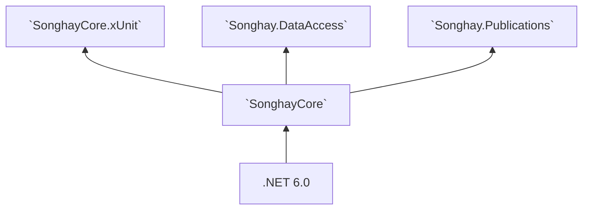

# SonghayCore

The _Core_ code to install as [a NuGet package](https://www.nuget.org/packages/SonghayCore/) for all of my studio Solutions. Anyone who may be reading this 👀 is free to do the same. This package is based on [a project file](https://github.com/BryanWilhite/SonghayCore/blob/master/SonghayCore/SonghayCore.csproj) that supports [multi-targeting](http://gigi.nullneuron.net/gigilabs/multi-targeting-net-standard-class-libraries/), declaring support for `net6.0`.

**NuGet package 📦:** [`SonghayCore`](https://www.nuget.org/packages/SonghayCore/)

**documentation 📚:** [`SonghayCore` API](https://bryanwilhite.github.io/SonghayCore/latest/)

**coverlet test coverage 🔬☔:** [[report](https://bryanwilhite.github.io/SonghayCore/coverlet/)]

## version 6.0 changes

The dominant theme in version 6.0 is about adopting .NET 6.0. The [GitHub project for this release](https://github.com/users/BryanWilhite/projects/1/views/1) has the most documented details. Many version 6.0 changes are breaking changes.

Notable changes:

- [Issue #131](https://github.com/BryanWilhite/SonghayCore/issues/131) was about removing direct support for WPF and any members marked obsolete in previous releases.
- [Issue #135](https://github.com/BryanWilhite/SonghayCore/issues/135) was about separating Newtonsoft JSON routines from the Core.
- [Issue #137](https://github.com/BryanWilhite/SonghayCore/issues/137) was about recognizing the new nullability features of .NET.
- [Issue #140](https://github.com/BryanWilhite/SonghayCore/issues/140) was about finally adding coverlet code coverage.

## _core_ reusable, opinionated concerns

### `Songhay.Diagnostics`

This _Core_ is exclusively concerned with _tracing_. Logging concerns should be logically above this _Core_. [`TraceSources`](https://github.com/BryanWilhite/SonghayCore/blob/master/SonghayCore/Diagnostics/TraceSources.cs) and [`TraceSourceExtensions`](https://github.com/BryanWilhite/SonghayCore/blob/master/SonghayCore/Extensions/TraceSourceExtensions.cs) define how tracing should be implemented with a bias toward using all source levels. When tracing is not configured for this _Core_ then it will be ignored without throwing exceptions.

For a review of the organizational difference between tracing and logging, see “[Tracing vs Logging vs Monitoring: What’s the Difference?](https://www.bmc.com/blogs/monitoring-logging-tracing/)” by [Chrissy Kidd](https://www.linkedin.com/in/chrissy-k-47294593).

**Documentation 📚:** [`Songhay.Diagnostics`](https://bryanwilhite.github.io/SonghayCore/latest/Songhay.Diagnostics/)

### `Songhay.Extensions`

The Songhay System uses imperative C# code with a view to make it more functional in an effort to control complexity and enhance maintainability.

The preference for [extension methods](https://github.com/BryanWilhite/SonghayCore/tree/master/SonghayCore/Extensions) encourages stateless, reusable routines (many of them are “pure” functions).

Notable extensions:

- [`IConfigurationBuilderExtensions`](https://github.com/BryanWilhite/SonghayCore/blob/master/SonghayCore/Extensions/IConfigurationBuilderExtensions.cs) — defines shared routines for application configuration building under .NET Standard.

- [`HttpRequestMessageExtensions`](https://github.com/BryanWilhite/SonghayCore/blob/master/SonghayCore/Extensions/HttpRequestMessageExtensions.cs) — defines shared routines for HTTP access under .NET Standard with a lazy-loaded `HttpClient`. Routines for Azure Blob Storage are included here.

- [`HttpWebRequestExtensions`](https://github.com/BryanWilhite/SonghayCore/blob/master/SonghayCore/Extensions/HttpWebRequestExtensions.cs) — defines shared routines for HTTP access for the legacy .NET Framework.

- [`TraceSourceExtensions`](https://github.com/BryanWilhite/SonghayCore/blob/master/SonghayCore/Extensions/TraceSourceExtensions.cs) — defines shared routines for `TraceSource`-based logging, using work by [Zijian Huang](https://github.com/zijianhuang/Fonlow.Diagnostics).

There is support for [URI templates](http://tools.ietf.org/html/rfc6570) (to be used with [`RestApiMetadata`](https://github.com/BryanWilhite/SonghayCore/blob/master/SonghayCore/Models/RestApiMetadata.cs)) in the form of [extension methods](https://github.com/BryanWilhite/SonghayCore/blob/master/SonghayCore/Extensions/RestApiMetadataExtensions.Tavis.cs), running on top of [`Tavis.UriTemplates`](https://github.com/tavis-software/Tavis.UriTemplates).

**Documentation 📚:** [`Songhay.Extensions`](https://bryanwilhite.github.io/SonghayCore/latest/Songhay.Extensions/)

### `Songhay.Models`

The _Core_ models of the Songhay System define types for MIME, XHTML, OPML, REST, the Repository, the Display Item (for WPF and other MVVM solutions), etc.

The _Core_ models are “anemic” by design (there are very few abstract classes)—any logic would be found _first_ in an Extension Method.

Notable models:

- [`DisplayItemModel`](https://github.com/BryanWilhite/SonghayCore/blob/master/SonghayCore/Models/DisplayItemModel.cs) — defines the conventional way to display data.

- [`MenuDisplayItemModel`](https://github.com/BryanWilhite/SonghayCore/blob/master/SonghayCore/Models/MenuDisplayItemModel.cs) — defines the conventional way to display nested/grouped data.

- [`RestApiMetadata`](https://github.com/BryanWilhite/SonghayCore/blob/master/SonghayCore/Models/RestApiMetadata.cs) — defines conventional REST API metadata.

**Documentation 📚:** [`Songhay.Models`](https://bryanwilhite.github.io/SonghayCore/latest/Songhay.Models/)

### `Songhay.Xml`

The “core” of the _Core_ is concern for XML. The Songhay System started out as utilities around [`XPathDocument`](https://msdn.microsoft.com/en-us/library/system.xml.xpath.xpathdocument(v=vs.110).aspx) and grew into LINQ for XML—over [`XDocument`](https://msdn.microsoft.com/en-us/library/system.xml.linq.xdocument(v=vs.110).aspx).

**Documentation 📚:** [`Songhay.Xml`](https://bryanwilhite.github.io/SonghayCore/latest/Songhay.Xml/)

## satellite packages

### `SonghayCore.xUnit`

Defines reusable class definitions for [xUnit](https://xunit.net/). Featured is the [`ProjectFileDataAttribute`](https://github.com/BryanWilhite/SonghayCore/blob/master/SonghayCore.xUnit/ProjectFileDataAttribute.cs), allowing test data files to be loaded from a relative path.

**NuGet package 📦:** [`SonghayCore.xUnit`](http://www.nuget.org/packages/SonghayCore.xUnit/)

**Documentation 📚:** [`Songhay.Tests`](https://bryanwilhite.github.io/SonghayCore/latest/Songhay.Tests/)

### `SonghayCore.Newtonsoft`

Core reusable, opinionated Newtonsoft concerns for my C# projects.

**GitHub repo:** <https://github.com/BryanWilhite/SonghayCore.Newtonsoft>

**NuGet package 📦:** [`SonghayCore.Newtonsoft`](https://www.nuget.org/packages/SonghayCore.Newtonsoft/)

## Studio packages dependent on `SonghayCore`

@[BryanWilhite](https://twitter.com/BryanWilhite)
