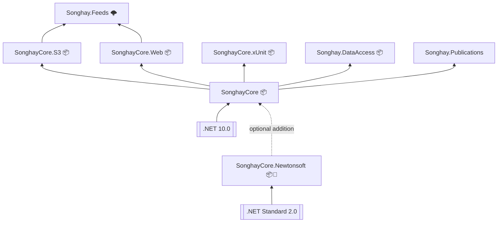

# SonghayCore

Here is the _Core_ code to install as [a NuGet package](https://www.nuget.org/packages/SonghayCore/) for all of my studio Solutions. Anyone who may be reading this 👀 is free to do the same. This package is based on `net10.0`.

**NuGet package 📦:** [`SonghayCore`](https://www.nuget.org/packages/SonghayCore/)

**documentation 📚:** [`SonghayCore` API](https://bryanwilhite.github.io/SonghayCore/)

## _core_ reusable, opinionated concerns

### `Songhay.Hosting`

One of the most important additions to .NET came in .NET 6.0 (circa 2021): the _.NET Generic Host_ [📖 [docs](https://learn.microsoft.com/en-us/dotnet/core/extensions/generic-host)]. This _host_ concept from Microsoft allows developers to _not_ have to reinvent:

- Dependency injection (DI)
- Logging
- Configuration
- App shutdown
- `IHostedService` implementations (for long-running background tasks 📖 [docs](https://learn.microsoft.com/en-us/dotnet/core/extensions/timer-service?pivots=dotnet-7-0)🔖)

All ASP.NET developers expect to get these things “for free” and, finally, Microsoft is basically letting all .NET developers get these things for free. This _Core_ recognizes the _.NET Generic Host_, stating with the `DefaultHostedService` [class](https://github.com/BryanWilhite/SonghayCore/blob/master/SonghayCore/Hosting/DefaultHostedService.cs) (see `Songhay.Extensions` below for more details).

### `Songhay.Diagnostics`

This _Core_ is concerned with _tracing_ as well as logging. Logging concerns should be logically above this _Core_. [`TraceSources`](https://github.com/BryanWilhite/SonghayCore/blob/master/SonghayCore/Diagnostics/TraceSources.cs) and [`TraceSourceExtensions`](https://github.com/BryanWilhite/SonghayCore/blob/master/SonghayCore/Extensions/TraceSourceExtensions.cs) define how tracing should be implemented with a bias toward using all source levels. When tracing is not configured for this _Core_ then it will be ignored without throwing exceptions.

For a review of the organizational difference between tracing and logging, see “[Tracing vs Logging vs Monitoring: What’s the Difference?](https://www.bmc.com/blogs/monitoring-logging-tracing/)” by [Chrissy Kidd](https://www.linkedin.com/in/chrissy-k-47294593).

**Documentation 📚:** [`Songhay.Diagnostics`](https://bryanwilhite.github.io/SonghayCore/latest/Songhay.Diagnostics.html)

### `Songhay.Extensions`

The Songhay System uses imperative C# code with a view to make it more functional in an effort to control complexity and enhance maintainability.

The preference for [extension methods](https://github.com/BryanWilhite/SonghayCore/tree/master/SonghayCore/Extensions) encourages stateless, reusable routines (many of them are “pure” functions).

Notable extensions:

- [`IConfigurationExtensions`](https://github.com/BryanWilhite/SonghayCore/blob/master/SonghayCore/Extensions/IConfigurationExtensions.cs) — defines shared routines based on conventions around the _.NET Generic Host_ [📖 [docs](https://learn.microsoft.com/en-us/dotnet/core/extensions/generic-host)].
- [`IConfigurationBuilderExtensions`](https://github.com/BryanWilhite/SonghayCore/blob/master/SonghayCore/Extensions/IConfigurationBuilderExtensions.cs) — defines shared routines for application configuration building under .NET Standard.
- [`ILoggerExtensions`](https://github.com/BryanWilhite/SonghayCore/blob/master/SonghayCore/Extensions/ILoggerExtensions.cs) — defines shared routines based on conventions around the _.NET Generic Host_ [📖 [docs](https://learn.microsoft.com/en-us/dotnet/core/extensions/generic-host)].
- [`HttpRequestMessageExtensions`](https://github.com/BryanWilhite/SonghayCore/blob/master/SonghayCore/Extensions/HttpRequestMessageExtensions.cs) — defines shared routines for HTTP access. Routines for Azure Blob Storage are included here.
- [`HttpWebRequestExtensions`](https://github.com/BryanWilhite/SonghayCore/blob/master/SonghayCore/Extensions/HttpWebRequestExtensions.cs) — defines shared routines for HTTP access for the legacy .NET Framework.

There is support for [URI templates](http://tools.ietf.org/html/rfc6570) (to be used with [`RestApiMetadata`](https://github.com/BryanWilhite/SonghayCore/blob/master/SonghayCore/Models/RestApiMetadata.cs)) in the form of [extension methods](https://github.com/BryanWilhite/SonghayCore/blob/master/SonghayCore/Extensions/RestApiMetadataExtensions.Tavis.cs), running on top of [`Tavis.UriTemplates`](https://github.com/tavis-software/Tavis.UriTemplates).

**Documentation 📚:** [`Songhay.Extensions`](https://bryanwilhite.github.io/SonghayCore/latest/Songhay.Extensions.html)

### `Songhay.Models`

The _Core_ models of the Songhay System define types for MIME, XHTML, OPML, REST, the Repository, the Display Item (for WPF and other MVVM solutions), etc.

The _Core_ models are “anemic” by design (there are very few abstract classes)—any logic would be found _first_ in an Extension Method.

Notable models for the client side:

- [`DisplayItemModel`](https://github.com/BryanWilhite/SonghayCore/blob/master/SonghayCore/Models/DisplayItemModel.cs) — defines the conventional way to display data.
- [`MenuDisplayItemModel`](https://github.com/BryanWilhite/SonghayCore/blob/master/SonghayCore/Models/MenuDisplayItemModel.cs) — defines the conventional way to display nested/grouped data.
- [`RestApiMetadata`](https://github.com/BryanWilhite/SonghayCore/blob/master/SonghayCore/Models/RestApiMetadata.cs) — defines conventional REST API metadata.

Selected server-side models:

- [`EndpointContentResult`](https://github.com/BryanWilhite/SonghayCore/blob/master/SonghayCore/Models/EndpointContentResult.cs) — defines the result returned from all Web-based, boundary-crossing Activities.
- [`ProgramOutputResult`](https://github.com/BryanWilhite/SonghayCore/blob/master/SonghayCore/Models/ProgramOutputResult.cs) — defines the general-purpose Result concept of Program completion with output, avoiding third-party dependencies that are not compatible with F♯.
- [`StorageObject`](https://github.com/BryanWilhite/SonghayCore/blob/master/SonghayCore/Models/StorageObject.cs) — defines an “intersection type” for the `S3Object` defacto standard and `FileInfo`.

**Documentation 📚:** [Namespace `Songhay.Models`](https://bryanwilhite.github.io/SonghayCore/latest/Songhay.Models.html)

### `Songhay.Xml`

The “core” of the _Core_ is concern for XML. The Songhay System started out as utilities around [`XPathDocument`](https://msdn.microsoft.com/en-us/library/system.xml.xpath.xpathdocument(v=vs.110).aspx) and grew into LINQ for XML—over [`XDocument`](https://msdn.microsoft.com/en-us/library/system.xml.linq.xdocument(v=vs.110).aspx).

**Documentation 📚:** [Namespace `Songhay.Xml`](https://bryanwilhite.github.io/SonghayCore/latest/Songhay.Xml.html)

## the _core_ Activity concept

This _Core_ features the concept of the Activity which is to be seen in the context of workflow solutions like Windows Workflow Foundation, [Durable Task](https://learn.microsoft.com/en-us/azure/durable-task/common/what-is-durable-task) and the [dapr Workflow](https://docs.dapr.io/developing-applications/building-blocks/workflow/workflow-overview/) building block. The following abstractions classify the Activities needed so far:

- [`IActivity`](https://github.com/BryanWilhite/SonghayCore/blob/master/SonghayCore/Abstractions/IActivity.cs) — defines the conventional, synchronous, input-output Activities
- [`IActivityOutputOnly`](https://github.com/BryanWilhite/SonghayCore/blob/master/SonghayCore/Abstractions/IActivityOutputOnly.cs) — defines the conventional, synchronous Activities with output only (input usually comes from `IConfiguration` in this case)
- [`IActivityOutputOnlyTask`](https://github.com/BryanWilhite/SonghayCore/blob/master/SonghayCore/Abstractions/IActivityOutputOnlyTask.cs) — defines the conventional, asynchronous Activities with output only (input usually comes from `IConfiguration` in this case)
- [`IActivityTask`](https://github.com/BryanWilhite/SonghayCore/blob/master/SonghayCore/Abstractions/IActivityTask.cs) — defines the conventional, asynchronous, input-output Activities

This Activity concept exists to formally recognize that a _Program_ is a ‘tree’ of inputs and outputs—the process we are drawing to form an Activity should be shaped like a tree 🌳

## satellite packages

### `SonghayCore.S3`

Amazon S3 routines for .NET Core. Outside of the world of the Microsoft cloud (Azure), the rest of the world’s cloud storage is (mostly) standardized around the AWS S3 <acronym title="Application Programming Interface">API</acronym>. Financial motivations lead one to respect this reality and the following Activities were added for access to S3 storage:

- [`AmazonS3DeleteS3ObjectActivity`](https://github.com/BryanWilhite/SonghayCore/blob/master/SonghayCore.S3/Activities/AmazonS3DeleteS3ObjectActivity.cs)
- [`AmazonS3DownloadToStringActivity`](https://github.com/BryanWilhite/SonghayCore/blob/master/SonghayCore.S3/Activities/AmazonS3DownloadToStringActivity.cs)
- [`AmazonS3ListBucketObjectsWithPaginationActivity`](https://github.com/BryanWilhite/SonghayCore/blob/master/SonghayCore.S3/Activities/AmazonS3ListBucketObjectsWithPaginationActivity.cs)
- [`AmazonS3UploadStringActivity`](https://github.com/BryanWilhite/SonghayCore/blob/master/SonghayCore.S3/Activities/AmazonS3UploadStringActivity.cs)

**NuGet package 📦:** [`SonghayCore.S3`](http://www.nuget.org/packages/SonghayCore.S3/)

**Documentation 📚:** [Namespace `Songhay.S3`](https://bryanwilhite.github.io/SonghayCore/latest/Songhay.S3.html)

### `SonghayCore.Web`

Extensions and Handlers for Songhay Web projects. Specifically, this renewed investment in ASP.NET minimal Web API is needed to develop <acronym title="ahead of time">AOT</acronym>-compiled .NET microservices for <acronym title="Open Container Initiative">OCI</acronym>-compliant containers.

**NuGet package 📦:** [`SonghayCore.Web`](http://www.nuget.org/packages/SonghayCore.Web/)

**Documentation 📚:** [Namespace `Songhay.Web`](https://bryanwilhite.github.io/SonghayCore/latest/Songhay.Web.html)

### `SonghayCore.xUnit`

Defines reusable class definitions for [xUnit](https://xunit.net/). Featured is the [`ProjectFileDataAttribute`](https://github.com/BryanWilhite/SonghayCore/blob/master/SonghayCore.xUnit/ProjectFileDataAttribute.cs), allowing test data files to be loaded from a relative path.

**NuGet package 📦:** [`SonghayCore.xUnit`](http://www.nuget.org/packages/SonghayCore.xUnit/)

**Documentation 📚:** [Namespace `Songhay.Tests`](https://bryanwilhite.github.io/SonghayCore/latest/Songhay.Tests.html)

## `SonghayCore.Newtonsoft`

Core reusable, opinionated Newtonsoft concerns for my C# projects.

**GitHub repo:** <https://github.com/BryanWilhite/SonghayCore.Newtonsoft>

**NuGet package 📦:** [`SonghayCore.Newtonsoft`](https://www.nuget.org/packages/SonghayCore.Newtonsoft/)

## Studio packages dependent on `SonghayCore`

```mermaid
flowchart BT
    netstandard2[[.NET Standard 2.0]]
    net10[[.NET 10.0]]

    1[SonghayCore 📦]
    2[SonghayCore.Newtonsoft 📦🧊]

    net10-->1
    netstandard2-->2
    2-..->|optional addition|1

    1-->3[SonghayCore.S3 📦]
    1-->4[SonghayCore.Web 📦]
    1-->5[SonghayCore.xUnit 📦]
    1-->6[Songhay.DataAccess 📦]
    1-->8[Songhay.Publications]

    3-->7[Songhay.Feeds 🌩]
    4-->7[Songhay.Feeds 🌩]
```

[Bryan Wilhite is on LinkedIn](https://www.linkedin.com/in/wilhite)🇺🇸💼
