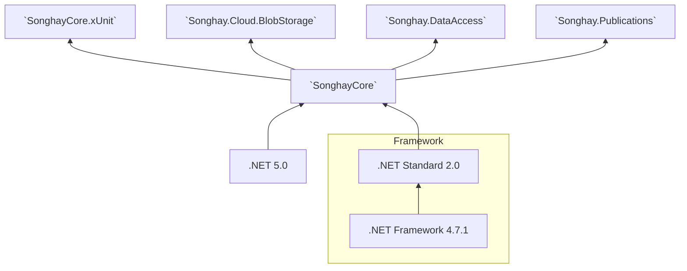

# SonghayCore

The _Core_ code to install as [a NuGet package](https://www.nuget.org/packages/SonghayCore/) for all of my studio Solutions. Anyone who may be reading this 👀 is free to do the same. This package is based on [a project file](https://github.com/BryanWilhite/SonghayCore/blob/master/SonghayCore/SonghayCore.csproj) that supports [multi-targeting](http://gigi.nullneuron.net/gigilabs/multi-targeting-net-standard-class-libraries/), declaring support for `net5.0` and `netstandard2.0`.

**NuGet package 📦:** [`SonghayCore`](https://www.nuget.org/packages/SonghayCore/)

**Documentation 📚:** [`SonghayCore` API](https://bryanwilhite.github.io/SonghayCore/latest/)

## version 5.0 breaking changes

The dominant theme in version 5.0 is about dropping direct support for .NET Framework. Microsoft strongly suggests that we support the .NET Framework legacy through targeting .NET Standard 2.0 because .NET Framework 4.71 supports .NET Standard 2.0.

>We recommend you skip .NET Standard 2.1 and go straight to .NET 5. Most widely used libraries will end up multi-targeting for both .NET Standard 2.0 and .NET 5. Supporting .NET Standard 2.0 gives you the most reach, while supporting .NET 5 ensures you can leverage the latest platform features for customers that are already on .NET 5.
>
><https://docs.microsoft.com/en-us/dotnet/standard/net-standard#when-to-target-net50-vs-netstandard>

[An issue covers](https://github.com/BryanWilhite/SonghayCore/issues/67#issuecomment-727517773) this particular subject.

Other notable breaking changes:

- The `Framework*` prefix was replaced with `Program*` [[#68](https://github.com/BryanWilhite/SonghayCore/issues/68)]
- `LatinGlyphs` was renamed to `LatinGlyphsUtility` [[#94](https://github.com/BryanWilhite/SonghayCore/issues/94)]
- `SmtpUtility` has been changed to support `MailMessage` and `Attachment` generation only 🔨🔥 [[#102](https://github.com/BryanWilhite/SonghayCore/issues/102)]
- `SonghayCore.MSTest` is no longer included going forward. It has been removed. 🚜🔥

## _core_ reusable, opinionated concerns

### `Songhay.Diagnostics`

This _Core_ is exclusively concerned with _tracing_. Logging concerns should be logically above this _Core_. [`TraceSources`](https://github.com/BryanWilhite/SonghayCore/blob/master/SonghayCore/Diagnostics/TraceSources.cs) and [`TraceSourceExtensions`](https://github.com/BryanWilhite/SonghayCore/blob/master/SonghayCore/Extensions/TraceSourceExtensions.cs) define how tracing should be implemented with a bias toward using all source levels. When tracing is not configured for this _Core_ then it will be ignored without throwing exceptions.

For a review of the organizational difference between tracing and logging, see “[Tracing vs Logging vs Monitoring: What’s the Difference?](https://www.bmc.com/blogs/monitoring-logging-tracing/)” by [Chrissy Kidd](https://www.linkedin.com/in/chrissy-k-47294593).

**Documentation 📚:** [`Songhay.Diagnostics`](https://bryanwilhite.github.io/SonghayCore/api/Songhay.Diagnostics/)

### `Songhay.Extensions`

The Songhay System uses imperative C# code with a view to make it more functional in an effort to control complexity and enhance maintainability.

The preference for [extension methods](https://github.com/BryanWilhite/SonghayCore/tree/master/SonghayCore/Extensions) encourages stateless, reusable routines (many of them are “pure” functions).

Notable extensions:

- [`IConfigurationBuilderExtensions`](https://github.com/BryanWilhite/SonghayCore/blob/master/SonghayCore/Extensions/IConfigurationBuilderExtensions.cs) — defines shared routines for application configuration building under .NET Standard.

- [`HttpRequestMessageExtensions`](https://github.com/BryanWilhite/SonghayCore/blob/master/SonghayCore/Extensions/HttpRequestMessageExtensions.cs) — defines shared routines for HTTP access under .NET Standard with a lazy-loaded `HttpClient`.

- [`HttpWebRequestExtensions`](https://github.com/BryanWilhite/SonghayCore/blob/master/SonghayCore/Extensions/HttpWebRequestExtensions.cs) — defines shared routines for HTTP access for the legacy .NET Framework.

- [`TraceSourceExtensions`](https://github.com/BryanWilhite/SonghayCore/blob/master/SonghayCore/Extensions/TraceSourceExtensions.cs) — defines shared routines for `TraceSource`-based logging, using work by [Zijian Huang](https://github.com/zijianhuang/Fonlow.Diagnostics).

There is support for [URI templates](http://tools.ietf.org/html/rfc6570) (to be used with [`RestApiMetadata`](https://github.com/BryanWilhite/SonghayCore/blob/master/SonghayCore/Models/RestApiMetadata.cs)) in the form of [extension methods](https://github.com/BryanWilhite/SonghayCore/blob/master/SonghayCore/Extensions/RestApiMetadataExtensions.Tavis.cs), running on top of [`Tavis.UriTemplates`](https://github.com/tavis-software/Tavis.UriTemplates).

**Documentation 📚:** [`Songhay.Extensions`](https://bryanwilhite.github.io/SonghayCore/api/Songhay.Extensions/)

### `Songhay.Models`

The _Core_ models of the Songhay System define types for MIME, XHTML, OPML, REST, the Repository, the Display Item (for WPF and other MVVM solutions), etc.

The _Core_ models are “anemic” by design (there are very few abstract classes)—any logic would be found _first_ in an Extension Method.

Notable models:

- [`DisplayItemModel`](https://github.com/BryanWilhite/SonghayCore/blob/master/SonghayCore/Models/DisplayItemModel.cs) — defines the conventional way to display data.

- [`MenuDisplayItemModel`](https://github.com/BryanWilhite/SonghayCore/blob/master/SonghayCore/Models/MenuDisplayItemModel.cs) — defines the conventional way to display nested/grouped data.

- [`RestApiMetadata`](https://github.com/BryanWilhite/SonghayCore/blob/master/SonghayCore/Models/RestApiMetadata.cs) — defines conventional REST API metadata.

**Documentation 📚:** [`Songhay.Models`](https://bryanwilhite.github.io/SonghayCore/api/Songhay.Models/)

### `Songhay.Xml`

The “core” of the _Core_ is concern for XML. The Songhay System started out as utilities around [`XPathDocument`](https://msdn.microsoft.com/en-us/library/system.xml.xpath.xpathdocument(v=vs.110).aspx) and grew into LINQ for XML—over [`XDocument`](https://msdn.microsoft.com/en-us/library/system.xml.linq.xdocument(v=vs.110).aspx).

**Documentation 📚:** [`Songhay.Xml`](https://bryanwilhite.github.io/SonghayCore/api/Songhay.Xml/)

## satellite packages

### `SonghayCore.xUnit`

Defines reusable class definitions for [xUnit](https://xunit.net/). Featured is the [`ProjectFileDataAttribute`](https://github.com/BryanWilhite/SonghayCore/blob/master/SonghayCore.xUnit/ProjectFileDataAttribute.cs), allowing test data files to be loaded from a relative path.

**NuGet package 📦:** [`SonghayCore.xUnit`](http://www.nuget.org/packages/SonghayCore.xUnit/)

**Documentation 📚:** [`Songhay.Tests`](https://bryanwilhite.github.io/SonghayCore/api/Songhay.Tests/)

The diagram below shows all of the packages depending on `SonghayCore` in my Studio:

## Studio packages dependent on `SonghayCore`

@[BryanWilhite](https://twitter.com/BryanWilhite)
